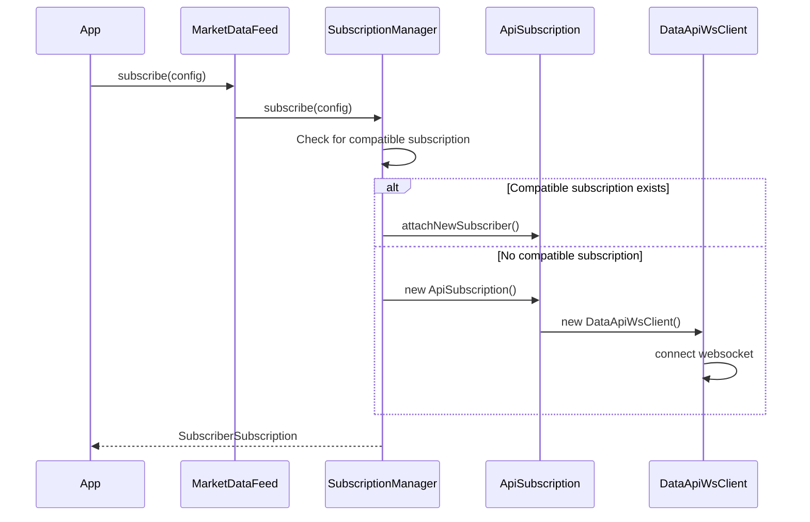

## Overview

The `MarketDataFeed` is a singleton class that manages websocket connections to the Drift Data API. It intelligently shares websocket connections between multiple subscribers when possible, reducing resource usage and improving performance.

<Warning>
  This is an internal class primarily used by `CandleClient`. Most applications should use `CandleClient` instead of using `MarketDataFeed` directly.
</Warning>

## Key Features

- **Singleton Pattern**: Single instance manages all subscriptions
- **Subscription Sharing**: Multiple subscribers can share the same websocket connection
- **Automatic Transfer**: Trade subscribers automatically transfer to more efficient subscriptions when available
- **Type-Safe**: Separate subscription types for candles and trades with proper type inference
- **Memory Efficient**: Automatic cleanup when subscriptions are no longer needed

## Architecture

### Core Concepts

**Subscription vs Subscriber:**
- A **subscription** is an actual websocket connection to the Drift Data API
- A **subscriber** is an external party requesting data (candle or trade)
- One subscription can serve multiple subscribers

**Subscription Compatibility:**
- **Trade subscriptions**: Can share any subscription for the same market (regardless of resolution)
- **Candle subscriptions**: Must share the same market AND resolution

### Subscription Sharing Example

```typescript
// Timeline of subscriptions:

// 1. SOL-PERP Resolution-1 candle subscriber
//    → Creates Subscription A (SOL-PERP, Resolution-1)

// 2. SOL-PERP Resolution-5 candle subscriber  
//    → Creates Subscription B (SOL-PERP, Resolution-5)
//    (different resolution, can't share)

// 3. SOL-PERP trade subscriber
//    → Uses existing Subscription A
//    (trades work with any resolution)

// 4. Another SOL-PERP Resolution-1 candle subscriber
//    → Uses existing Subscription A
//    (same market and resolution)
```

### Automatic Transfer Optimization

When subscriptions change, the system automatically optimizes:

```typescript
// Initial state:
// - Subscription A: SOL-PERP Resolution-1 (trade subscriber only)

// New candle subscriber comes in:
// - Subscription B: SOL-PERP Resolution-1 (candle subscriber)

// System automatically:
// 1. Transfers trade subscriber from A to B
// 2. Closes Subscription A (no longer needed)
// Result: Single subscription serving both subscribers
```

## Static Methods

### subscribe

Subscribe to candle or trade data. Returns a subscription object with an observable stream.

```typescript
static subscribe(
  config: CandleSubscriptionConfig
): CandleSubscriberSubscription;

static subscribe(
  config: TradeSubscriptionConfig  
): TradeSubscriberSubscription;
```

#### Parameters

<ParamField path="config" type="SubscriptionConfig" required>
  Subscription configuration
  
  <Expandable title="CandleSubscriptionConfig">
    <ParamField path="type" type="'candles'" required>
      Subscription type
    </ParamField>
    
    <ParamField path="env" type="UIEnv" required>
      Environment configuration
    </ParamField>
    
    <ParamField path="marketSymbol" type="MarketSymbol" required>
      Market symbol (e.g., 'SOL-PERP')
    </ParamField>
    
    <ParamField path="resolution" type="CandleResolution" required>
      Candle resolution
    </ParamField>
  </Expandable>
  
  <Expandable title="TradeSubscriptionConfig">
    <ParamField path="type" type="'trades'" required>
      Subscription type
    </ParamField>
    
    <ParamField path="env" type="UIEnv" required>
      Environment configuration
    </ParamField>
    
    <ParamField path="marketSymbol" type="MarketSymbol" required>
      Market symbol (e.g., 'SOL-PERP')
    </ParamField>
  </Expandable>
</ParamField>

#### Returns

Subscription object with:
- `id`: Unique subscriber ID
- `observable`: RxJS Observable stream of data

#### Example: Candle Subscription

```typescript
import { MarketDataFeed } from '@drift-labs/common';

const candleSubscription = MarketDataFeed.subscribe({
  type: 'candles',
  env: { sdkEnv: 'mainnet-beta', isDevnet: false, isStaging: false, key: 'mainnet' },
  marketSymbol: 'SOL-PERP',
  resolution: '15'
});

candleSubscription.observable.subscribe((candle) => {
  console.log('Candle update:', candle);
  console.log(`Price: ${candle.close}, Volume: ${candle.volume}`);
});

// Later: clean up
MarketDataFeed.unsubscribe(candleSubscription.id);
```

#### Example: Trade Subscription

```typescript
const tradeSubscription = MarketDataFeed.subscribe({
  type: 'trades',
  env: { sdkEnv: 'mainnet-beta', isDevnet: false, isStaging: false, key: 'mainnet' },
  marketSymbol: 'BTC-PERP'
});

tradeSubscription.observable.subscribe((trades) => {
  console.log(`Received ${trades.length} trades`);
  trades.forEach(trade => {
    console.log(`Price: ${trade.price}, Size: ${trade.size}`);
  });
});
```

### unsubscribe

Unsubscribe from a subscription using its ID.

```typescript
static unsubscribe(subscriberId: SubscriberId): void
```

#### Parameters

<ParamField path="subscriberId" type="SubscriberId" required>
  Subscriber ID returned from `subscribe()`
</ParamField>

#### Example

```typescript
const subscription = MarketDataFeed.subscribe(config);

// Later...
MarketDataFeed.unsubscribe(subscription.id);
```

## Internal Classes

### ApiSubscription

Manages a single websocket connection and distributes data to attached subscribers.

**Key responsibilities:**
- Establishes websocket connection via `DataApiWsClient`
- Manages lists of candle and trade subscribers
- Distributes incoming data to relevant subscribers
- Triggers cleanup when no subscribers remain

### CandleSubscriber / TradeSubscriber

Internal subscriber management classes that:
- Generate unique subscriber IDs
- Create RxJS Subject for data distribution
- Track the ApiSubscription they're attached to
- Provide the observable stream to external code

### SubscriptionLookup

Lookup table management for finding compatible existing subscriptions:

**CandleSubscriptionLookup:**
- Key: `{marketSymbol}:{resolution}:{env}`
- One ApiSubscription per unique key

**TradeSubscriptionLookup:**
- Key: `{marketSymbol}:{env}`  
- Multiple ApiSubscriptions possible (different resolutions)
- Returns first available compatible subscription

## Types

### CandleSubscriberSubscription

Subscription object for candle data:

```typescript
class CandleSubscriberSubscription {
  readonly id: SubscriberId;
  readonly observable: Observable<JsonCandle>;
}
```

### TradeSubscriberSubscription

Subscription object for trade data:

```typescript
class TradeSubscriberSubscription {
  readonly id: SubscriberId;
  readonly observable: Observable<JsonTrade[]>;
}
```

### JsonTrade

```typescript
interface JsonTrade {
  price: number;
  size: number;
  side: 'buy' | 'sell';
  ts: number;        // Timestamp in seconds
  // ... additional fields
}
```

## Advanced Usage

### Multiple Subscriptions with Shared Connections

```typescript
import { MarketDataFeed } from '@drift-labs/common';

// These will share the same websocket connection
const candle1 = MarketDataFeed.subscribe({
  type: 'candles',
  env: mainnetEnv,
  marketSymbol: 'SOL-PERP',
  resolution: '15'
});

const candle2 = MarketDataFeed.subscribe({
  type: 'candles',
  env: mainnetEnv,
  marketSymbol: 'SOL-PERP',
  resolution: '15'
});

const trades = MarketDataFeed.subscribe({
  type: 'trades',
  env: mainnetEnv,
  marketSymbol: 'SOL-PERP'
});

// All three subscribers share a single websocket connection!
```

### Handling Connection Errors

```typescript
import { catchError } from 'rxjs/operators';
import { EMPTY } from 'rxjs';

const subscription = MarketDataFeed.subscribe(config);

subscription.observable.pipe(
  catchError(error => {
    console.error('Subscription error:', error);
    // Return EMPTY to complete the stream gracefully
    return EMPTY;
  })
).subscribe({
  next: (candle) => handleCandle(candle),
  error: (err) => console.error('Stream error:', err),
  complete: () => console.log('Stream completed')
});
```

### Combining Multiple Market Feeds

```typescript
import { merge } from 'rxjs';
import { map } from 'rxjs/operators';

const markets = ['SOL-PERP', 'BTC-PERP', 'ETH-PERP'];

const subscriptions = markets.map(symbol => 
  MarketDataFeed.subscribe({
    type: 'candles',
    env: mainnetEnv,
    marketSymbol: symbol,
    resolution: '15'
  })
);

// Combine all streams
const combinedStream = merge(
  ...subscriptions.map((sub, idx) => 
    sub.observable.pipe(
      map(candle => ({ market: markets[idx], candle }))
    )
  )
);

combinedStream.subscribe(({ market, candle }) => {
  console.log(`${market}: ${candle.close}`);
});

// Cleanup
subscriptions.forEach(sub => MarketDataFeed.unsubscribe(sub.id));
```

## Performance Characteristics

### Memory Efficiency

- **Subscription Sharing**: Multiple subscribers = single websocket
- **Automatic Cleanup**: Connections close when last subscriber leaves
- **Transfer Optimization**: Redundant connections eliminated automatically

### Network Efficiency

- **Reduced Connections**: Fewer websockets = less bandwidth
- **CDN-Friendly**: Compatible subscriptions share cache-friendly connections
- **Heartbeat Monitoring**: Built into underlying `DataApiWsClient`

## Internal Architecture Details

### Subscription Lifecycle



### Transfer Optimization Logic

When a new candle subscription is created, the system:

1. Searches for existing trade-only subscriptions for the same market
2. If found, transfers all trade subscribers to the new candle subscription
3. Closes the old trade-only subscription
4. Result: Fewer websocket connections, same functionality

## Debugging

The MarketDataFeed logs important events to console:

```typescript
// Console output examples:
"marketDataFeed::creating_new_api_subscription:SOL-PERP:15:mainnet(0)"
"marketDataFeed::attaching_new_candle_subscriber_to_existing_subscription"
"marketDataFeed::transferring_trade_subscribers_on_unsubscribe"
"marketDataFeed::unsubscribing_api_subscription:SOL-PERP:15:mainnet(0)"
```

## Related

<CardGroup cols={2}>
  <Card title="CandleClient" icon="chart-candlestick" href="/api/clients/candle-client">
    Higher-level candle data client
  </Card>
  
  <Card title="Data API Websocket" icon="plug" href="https://data.api.drift.trade/playground">
    Underlying websocket API documentation
  </Card>
</CardGroup>